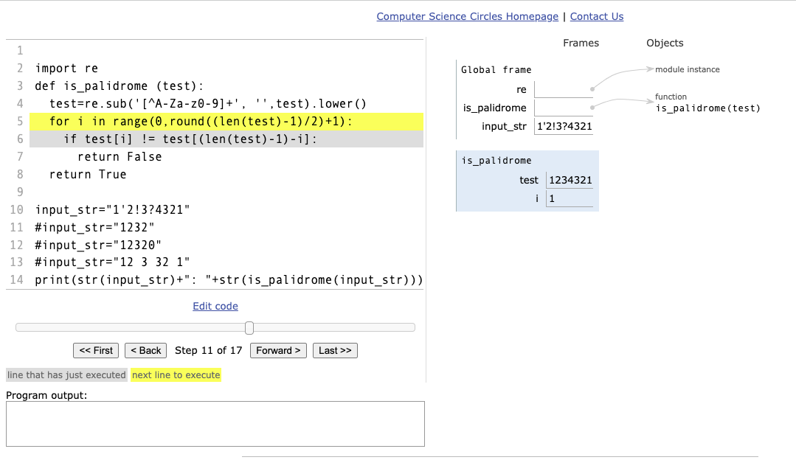

## is_palidrome


> A palindrome is a word or phrase that reads the same forwards as it does backwards... 
> Your function should only consider letters, A through Z, when evaluating the string and you should ignore their case, treating uppercase and lowercase letters as being the same. 


### Step01 - Base functionality 

* basic tests below show this is working
* I will also need to remove white space, punctation and make case insensitve (covered in step-02)
* it can be made more efficient (exit when first False found) (covered in step-03)


```
~/projects/python-code-challenges $ cat docs/is_palidrome.py
#test="12321"
#test="1232"
#test="12320"
test="123321"

print(test)
is_palidrome=True
for i in range(0,round((len(test)-1)/2)+1):
  print(str("round: ")+str(i))
  print(str(i)+","+str((len(test)-1)-i))
  print(test[i]+","+test[(len(test)-1)-i])
  if test[i] != test[(len(test)-1)-i]:
    is_palidrome=False
    print(str(i) + " False")


print (test + " " + str(is_palidrome))
```
and 
```
~/projects/python-code-challenges $ /usr/local/opt/python@3.9/bin/python3.9 /Users/dave/projects/python-code-challenges/docs/is_palidrome.py
12321
round: 0
0,4
1,1
round: 1
1,3
2,2
round: 2
2,2
3,3
12321 True
~/projects/python-code-challenges $ /usr/local/opt/python@3.9/bin/python3.9 /Users/dave/projects/python-code-challenges/docs/is_palidrome.py
1232
round: 0
0,3
1,2
0 False
round: 1
1,2
2,3
1 False
round: 2
2,1
3,2
2 False
1232 False
~/projects/python-code-challenges $ /usr/local/opt/python@3.9/bin/python3.9 /Users/dave/projects/python-code-challenges/docs/is_palidrome.py
1232
round: 0
0,3
1,2
0 False
round: 1
1,2
2,3
1 False
round: 2
2,1
3,2
2 False
1232 False
~/projects/python-code-challenges $ /usr/local/opt/python@3.9/bin/python3.9 /Users/dave/projects/python-code-challenges/docs/is_palidrome.py
123321
round: 0
0,5
1,1
round: 1
1,4
2,2
round: 2
2,3
3,3
123321 True
~/projects/python-code-challenges $ 
```

### Step02 - remove white space, punctation and make case insensitve

Searching through stackoverflow

* [remove-all-special-characters-punctuation-and-spaces-from-string-in-python](https://stackoverflow.com/questions/5843518/remove-all-special-characters-punctuation-and-spaces-from-string)
* [lowercase-string-in-python](https://stackoverflow.com/questions/6797984/how-do-i-lowercase-a-string-in-python)


Very simple checks:
```
~/projects/python-code-challenges $ python3
Python 3.9.1 (default, Dec 26 2020, 19:37:23) 
...
>>> test="Jacob's ladder"
>>> print(test)
Jacob's ladder
>>> import re;
>>> re.sub('[^A-Za-z0-9]+', '', test)
'Jacobsladder'
>>> re.sub('[^A-Za-z0-9]+', '', test)
'Jacobsladder'
>>> print(re.sub('[^A-Za-z0-9]+', '',test).lower())
jacobsladder
```

and update `is_palidrome.py` 

```
~/projects/python-code-challenges $ git diff docs/is_palidrome.py
diff --git a/docs/is_palidrome.py b/docs/is_palidrome.py
index 6a31aaf..60ee5e5 100644
--- a/docs/is_palidrome.py
+++ b/docs/is_palidrome.py
@@ -1,8 +1,11 @@
-#test="12321"
+import re
+test="1'2!3?21"
 #test="1232"
 #test="12320"
-test="123321"
-
+test="12 3 32 1"
+# https://stackoverflow.com/questions/5843518/remove-all-special-characters-punctuation-and-spaces-from-string
+# https://stackoverflow.com/questions/6797984/how-do-i-lowercase-a-string-in-python
+test=re.sub('[^A-Za-z0-9]+', '',test).lower()
 print(test)
 is_palidrome=True
 for i in range(0,round((len(test)-1)/2)+1):
 ```

and output looks good for `test="12 3 32 1"`
```
123321
round: 0
0,5
1,1
round: 1
1,4
2,2
round: 2
2,3
3,3
123321 True
```

and for `test="1'2!3?21"`

```
123321
round: 0
0,5
1,1
round: 1
1,4
2,2
round: 2
2,3
3,3
123321 True
```


### Step03 rewrite as function


```
import re
def is_palidrome (test):
  test=re.sub('[^A-Za-z0-9]+', '',test).lower()
  for i in range(0,round((len(test)-1)/2)+1):
    if test[i] != test[(len(test)-1)-i]:
      return False
  return True

input_str="1'2!3?4321"
#input_str="1232"
#input_str="12320"
#input_str="12 3 32 1"
print(str(input_str)+": "+str(is_palidrome(input_str)))
```

and testing this

```
~/projects/python-code-challenges $ /usr/local/opt/python@3.9/bin/python3.9 /Users/dave/projects/python-code-challenges/docs/is_palidrome.py
1'2!3?4321: True
~/projects/python-code-challenges $ /usr/local/opt/python@3.9/bin/python3.9 /Users/dave/projects/python-code-challenges/docs/is_palidrome.py
1232: False
~/projects/python-code-challenges $ /usr/local/opt/python@3.9/bin/python3.9 /Users/dave/projects/python-code-challenges/docs/is_palidrome.py
12320: False
~/projects/python-code-challenges $ /usr/local/opt/python@3.9/bin/python3.9 /Users/dave/projects/python-code-challenges/docs/is_palidrome.py
12 3 32 1: True
~/projects/python-code-challenges $ 
```


Next [visualizing is_palidrome](https://cscircles.cemc.uwaterloo.ca/visualize#code=%0Aimport+re%0Adef+is_palidrome+(test)%3A%0A++test%3Dre.sub('%5B%5EA-Za-z0-9%5D%2B',+'',test).lower()%0A++for+i+in+range(0,round((len(test)-1)/2)%2B1)%3A%0A++++if+test%5Bi%5D+!%3D+test%5B(len(test)-1)-i%5D%3A%0A++++++return+False%0A++return+True%0A%0Ainput_str%3D%221'2!3%3F4321%22%0A%23input_str%3D%221232%22%0A%23input_str%3D%2212320%22%0A%23input_str%3D%2212+3+32+1%22%0Aprint(str(input_str)%2B%22%3A+%22%2Bstr(is_palidrome(input_str)))%0A%0A&mode=display&raw_input=&curInstr=10)


